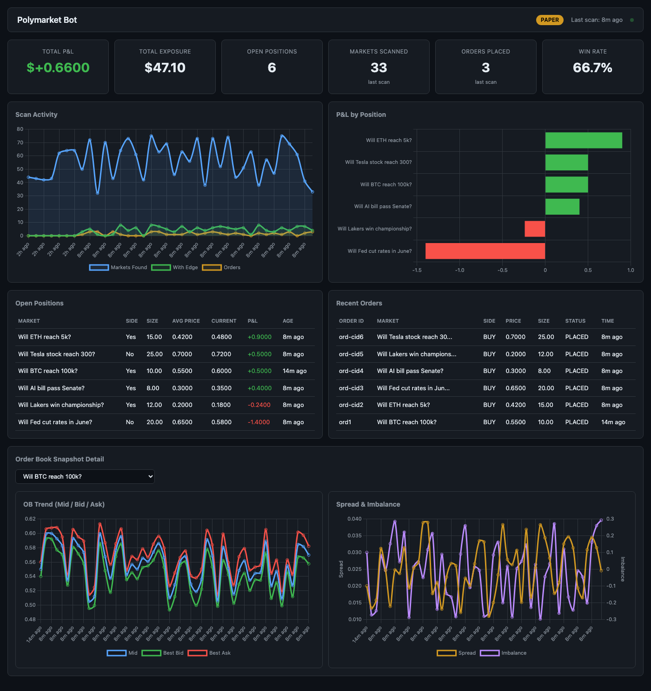

# Polymarket Trading Bot

A production-grade Python bot for Polymarket prediction markets. Combines the best implementations from 25+ open-source repos into a single, well-tested system with 246 tests and a real-time web dashboard.



## Table of Contents

- [Architecture](#architecture)
- [Features](#features)
- [Setup](#setup)
- [Usage](#usage)
- [Web Dashboard](#web-dashboard)
- [Configuration](#configuration)
- [Testing](#testing)
- [Project Structure](#project-structure)
- [Comparison Matrix](#comparison-matrix)

---

## Architecture

| Module | Primary Source Repos | Functionality |
|--------|---------------------|---------------|
| `clob_client.py` | Polymarket/py-clob-client, hbr-l/polypy | CLOB API wrapper, EIP-712 signing, HMAC auth, order execution |
| `market_scanner.py` | realfishsam/prediction-market-arbitrage-bot, Polymarket/poly-market-maker, demone456/kalshi-polymarket-bot | Gamma API market discovery, keyword classification |
| `kelly.py` | Polymarket/poly-market-maker, realfishsam/prediction-market-arbitrage-bot | Fractional Kelly criterion, position limits |
| `ssvi.py` | Polymarket/poly-market-maker, ThinkEnigmatic/polymarket-bot-arena | SSVI volatility surface fitting, probability extraction |
| `persistence.py` | perpetual-s/polymarket-python-infrastructure, Jonmaa/btc-polymarket-bot | SQLite state management (WAL mode), trade logging, OB snapshots |
| `redemption.py` | Polymarket/py-clob-client, Polymarket/go-order-utils | On-chain CTF redemption via web3.py |
| `bot.py` | Polymarket/poly-market-maker, Jonmaa/btc-polymarket-bot | Async scan loop, orchestration, circuit breaker |
| `config.py` | perpetual-s/polymarket-python-infrastructure | Environment-based configuration with validation |
| `backtest.py` | — | Monte Carlo backtesting with configurable accuracy levels |
| `dashboard.py` | — | FastAPI + Chart.js real-time web dashboard |

### Data Flow

```
Gamma API  ──►  market_scanner.py  ──►  ssvi.py / kelly.py  ──►  clob_client.py  ──►  Polymarket CLOB
                      │                                                │
                      ▼                                                ▼
                persistence.py (SQLite WAL)  ◄─────────────────────────┘
                      │
                      ▼
                dashboard.py (read-only)  ──►  Browser (Chart.js)
```

---

## Features

- **Paper mode**: Full simulation without real orders, with sqrt-based slippage model
- **GTC limit orders only**: No market orders, no IOC
- **Fractional Kelly sizing**: Configurable fraction (default 1/4 Kelly)
- **SQLite persistence**: Orders, positions, scan history, OB snapshots, market cache (WAL mode)
- **Async scanning loop**: Non-blocking market discovery with pagination
- **Market classification**: Crypto, politics, sports, finance, entertainment, science
- **SSVI calibration**: Implied vol surface fitting for crypto probability estimation
- **OB imbalance probability**: Bid/ask depth-weighted probability for non-crypto markets
- **On-chain redemption**: Redeem winning positions via web3.py
- **Position limits**: Configurable max exposure per market
- **Circuit breaker**: Auto-pause after repeated scan failures
- **Structured logging**: Text or JSON format with configurable levels
- **Web dashboard**: Real-time monitoring with charts, tables, and OB detail
- **Backtesting**: Monte Carlo simulation across accuracy levels

---

## Setup

```bash
# Clone the repo
git clone https://github.com/yourusername/polymarkt-bot.git
cd polymarkt-bot

# Install dependencies
pip install -e ".[dev]"

# Configure environment
cp .env.example .env
# Edit .env with your credentials (only needed for live trading)
```

### Requirements

- Python >= 3.11
- Dependencies: `aiohttp`, `numpy`, `scipy`, `web3`, `python-dotenv`, `fastapi`, `uvicorn`
- Dev: `pytest`, `pytest-asyncio`, `aioresponses`, `ruff`, `mypy`

---

## Usage

### Bot

```bash
# Paper mode, single scan
python bot.py --once --paper

# Paper mode, continuous loop (scans every 60s)
python bot.py --paper

# Live mode (requires real credentials in .env)
python bot.py --live

# Custom log level with JSON output
python bot.py --once --paper --log-level DEBUG --log-format json
```

### Backtesting

```bash
# Run Monte Carlo backtest
python backtest.py --trials 50 --accuracy 0.50,0.55,0.60

# Output: CSV report with P&L, Sharpe, max drawdown per accuracy level
```

### Dashboard

```bash
# Start dashboard (default: http://localhost:8050)
python dashboard.py --db data/bot.db

# Custom port and host
python dashboard.py --db data/bot.db --port 9000 --host 0.0.0.0

# Use live mode data
python dashboard.py --db data/bot.db --paper-mode 0
```

---

## Web Dashboard

The dashboard is a single-page FastAPI + Chart.js application that reads from the bot's SQLite database in read-only WAL mode. No build step, no npm — just start the server.

### Sections

| Section | Description |
|---------|-------------|
| **Header** | Paper/Live mode badge, last scan time, auto-refresh indicator (green pulse) |
| **Summary Cards** | Total P&L, exposure, open positions, markets scanned, orders placed, win rate |
| **Scan Activity Chart** | Line chart showing markets found, markets with edge, and orders over time |
| **P&L by Position** | Horizontal bar chart of P&L per open position (green = profit, red = loss) |
| **Open Positions Table** | Market name, side, size, avg price, current price, P&L, age |
| **Recent Orders Table** | Order ID, market, side, price, size, status, timestamp |
| **OB Snapshot Detail** | Dropdown to select a market, then Mid/Bid/Ask trend chart + Spread & Imbalance dual-axis chart |

### API Endpoints

| Endpoint | Description |
|----------|-------------|
| `GET /` | Serves the dashboard HTML |
| `GET /api/summary` | Total P&L, exposure, open position count, last scan info |
| `GET /api/positions` | Open positions joined with market cache for question text |
| `GET /api/orders?limit=50` | Recent orders joined with market cache |
| `GET /api/scans?limit=100` | Scan history for timeline chart |
| `GET /api/ob-snapshots?condition_id=X&limit=200` | OB time series for a specific market |
| `GET /api/ob-snapshots/latest?limit=50` | Most recent snapshots across all markets |
| `GET /api/config` | Current bot config (no secrets exposed) |

All endpoints accept an optional `paper_mode` query parameter (0 or 1).

---

## Configuration

All configuration is via environment variables (or `.env` file):

| Variable | Default | Description |
|----------|---------|-------------|
| `PAPER_MODE` | `true` | Enable paper trading (no real orders) |
| `SCAN_INTERVAL_SECONDS` | `60` | Seconds between market scans |
| `MAX_POSITION_USDC` | `100.0` | Max USDC per position |
| `KELLY_FRACTION` | `0.25` | Fraction of full Kelly to bet (0, 1] |
| `MIN_EDGE` | `0.02` | Minimum edge required to place order (0, 1) |
| `MAX_MARKETS` | `10` | Max markets to scan per cycle |
| `DB_PATH` | `data/bot.db` | SQLite database path |
| `LOG_LEVEL` | `INFO` | Logging level |
| `LOG_FORMAT` | `text` | `text` or `json` |
| `SSVI_R2_THRESHOLD` | `0.70` | Min R-squared for SSVI calibration |
| `SLIPPAGE_SPREAD_BPS` | `50` | Spread component of slippage (basis points) |
| `SLIPPAGE_IMPACT_BPS` | `10` | Impact component of slippage (basis points) |
| `MAX_CONSECUTIVE_FAILURES` | `5` | Failures before circuit breaker trips |
| `CIRCUIT_BREAKER_COOLDOWN` | `300` | Seconds to wait after circuit breaker trips |
| `MIN_TRADEABLE_PRICE` | `0.01` | Min market price to consider |
| `MAX_TRADEABLE_PRICE` | `0.99` | Max market price to consider |
| `MAX_SPREAD` | `0.10` | Max bid-ask spread to consider (0, 1) |
| `MIN_LIQUIDITY` | `5000.0` | Min market liquidity in USDC |
| `BANKROLL_MULTIPLIER` | `10.0` | Multiplier for bankroll estimation |
| `OB_IMBALANCE_WEIGHT` | `0.05` | Weight for OB imbalance probability adjustment (0, 0.20] |

Live trading also requires: `POLYMARKET_API_KEY`, `POLYMARKET_API_SECRET`, `POLYMARKET_API_PASSPHRASE`, `PRIVATE_KEY`.

---

## Testing

The test suite covers 246 tests across 10 test files:

```bash
# Run all tests
pytest tests/ -v

# Run with coverage
pytest tests/ -v --tb=short

# Run a specific module
pytest tests/test_kelly.py -v

# Skip slow tests
pytest tests/ -m "not slow"
```

### Test Summary

```
tests/test_bot_impact.py   .... 13 tests  -  Sqrt impact model, Kelly properties, classify properties
tests/test_clob_client.py  .... 21 tests  -  Order construction, validation, EIP-712 signing, HMAC auth
tests/test_config.py       .... 32 tests  -  Config validation, paper mode parsing, live mode checks
tests/test_integration.py  .... 29 tests  -  Full pipeline, circuit breaker, OB imbalance, slippage, logging
tests/test_kelly.py        .... 16 tests  -  Kelly criterion, multi-outcome, position limits
tests/test_market_scanner.py .. 28 tests  -  Classification, parsing, pagination, closed field handling
tests/test_persistence.py  .... 34 tests  -  DB init, locking, CRUD, VWAP accumulation, schema migration
tests/test_redemption.py   ....  6 tests  -  Redemption results, ABI checks, gas limits
tests/test_retry.py        .... 10 tests  -  Retry logic, exponential backoff, status code handling
tests/test_ssvi.py         .... 16 tests  -  SSVI fitting, probability extraction, synthetic surfaces
```

**Total: 246 tests, all passing**

### Test Categories

| Category | What's Tested |
|----------|---------------|
| **Unit tests** | Kelly criterion math, SSVI fitting, order construction, config validation |
| **Property-based tests** | Hypothesis-driven fuzzing for Kelly, classify, and garbage input handling |
| **Integration tests** | Full scan pipeline, circuit breaker behavior, paper slippage model |
| **Persistence tests** | DB lifecycle, VWAP accumulation, schema migrations, WAL mode |
| **API tests** | CLOB client order signing, HMAC auth, retry with backoff |

---

## Project Structure

```
polymarkt-bot/
├── bot.py                 # Main bot: async scan loop, orchestration, circuit breaker
├── backtest.py            # Monte Carlo backtesting engine
├── clob_client.py         # Polymarket CLOB API client, EIP-712, HMAC auth
├── config.py              # Environment-based config with validation
├── dashboard.py           # FastAPI web dashboard server
├── kelly.py               # Fractional Kelly criterion sizing
├── market_scanner.py      # Gamma API market discovery + classification
├── persistence.py         # SQLite persistence (WAL mode), migrations
├── redemption.py          # On-chain CTF position redemption
├── retry.py               # HTTP retry with exponential backoff
├── ssvi.py                # SSVI volatility surface calibration
├── static/
│   └── dashboard.html     # Single-page dashboard (Chart.js, dark theme)
├── docs/
│   └── dashboard.png      # Dashboard screenshot
├── tests/
│   ├── conftest.py        # Shared fixtures (temp DB, etc.)
│   ├── test_bot_impact.py # Impact model + property-based tests
│   ├── test_clob_client.py
│   ├── test_config.py
│   ├── test_integration.py
│   ├── test_kelly.py
│   ├── test_market_scanner.py
│   ├── test_persistence.py
│   ├── test_redemption.py
│   ├── test_retry.py
│   └── test_ssvi.py
├── pyproject.toml         # Build config, dependencies, tool settings
└── .env.example           # Template for environment variables
```

---

## Comparison Matrix

How this project combines the best of 10+ open-source Polymarket repos:

| Repo | CLOB Client | Order Exec | Market Scan | Kelly | SSVI | Proxy | EIP-712 | Redemption | Arbitrage |
|------|:-----------:|:----------:|:-----------:|:-----:|:----:|:-----:|:-------:|:----------:|:---------:|
| Polymarket/py-clob-client | **Best** | Good | - | - | - | Yes | **Best** | - | - |
| Polymarket/poly-market-maker | Good | **Best** | Good | Good | Good | Yes | Good | - | - |
| realfishsam/prediction-market-arbitrage-bot | - | - | **Best** | Good | - | - | - | - | **Best** |
| Jonmaa/btc-polymarket-bot | Good | Good | Good | - | - | - | Good | - | - |
| demone456/kalshi-polymarket-bot | Good | Good | Good | Good | - | - | - | - | Good |
| ThinkEnigmatic/polymarket-bot-arena | - | Good | Good | - | Good | - | - | - | - |
| perpetual-s/polymarket-python-infrastructure | Good | Good | - | - | - | **Best** | Good | - | - |
| hbr-l/polypy | Good | - | - | - | - | - | - | - | - |
| Polymarket/go-order-utils | - | - | - | - | - | - | Good | **Best** | - |
| JonathanPetersonn/oracle-lag-sniper | - | Good | - | - | - | - | - | - | Good |

---

## License

MIT
